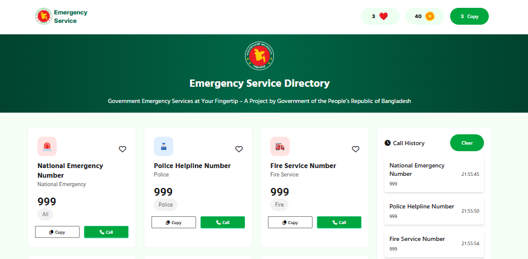

## WELCOME TO ( সহজ সরল সিম্পল ) ASSIGNMENT-005



### 6. Answer the following questions clearly:

1. What is the difference between **getElementById, getElementsByClassName, and querySelector / querySelectorAll**?  
   উত্তর:  
   ➡️ document.getElementById("id"): একটি নিদ্রিষ্টি আইডি দিতে শুধু মাত্র একটি এলিমেন্টকে বের করে নিয়ে আসে। যদি এলিমেন্ট না পায় তাহলে null দেয়।  
   ➡️ document.getElementsByClassName("className"): নিদ্রিষ্ট যে যে এলিমেন্ট এ ক্লাস থাকবে তাদেরকে ধরে ধরে আনবে । এটি এইচটিএমএল কালেকশন দেয়। যেটা দেখতে অনেকটাই এ্যারের মতো কিনতু এ্যারে না। ডমের মধ্যে যদি কোন আপডেট হয় এটা নিজে নিজে আপডেট করে নেয়।  
   ➡️ document.querySelector("CSS selector"): সিএসএস সিলেকটরের মাধ্যমে প্রথম এলিমেন্ট বেরকরে আনে। প্রথম এলিমেন্ট না পেলে null দেয়।  
   ➡️ document.querySelectorAll("CSS selector"): এটি সিএসএস বস সিলেক্টরকে ধরে ধরে বের করে আনে। এটি nodelist দেয় যেটা এ্যারের মতো এর ভিতরে forEach ব্যাহবার করা যায়। মে নতুন এলিমেন্ট হলে আপডেট হয় না।
   ***
2. How do you **create and insert a new element into the DOM**?  
   document.createElement() এর মাধ্যমে আমাদেরকে যে কোন একটি এলিমেন্ট তৈরি করে নিতে হবে। তার পরে একটা প্যারেন্ট এলিমেন্টের ভিতরে appendChild() এর মাধ্যমে প্যারেন্ট এলিমেন্টর ভিতরে পুশ করে দতে হবে।  
   উদাহরণ:

```
const div = document.createElement("div");
const p = document.createElement("p");
div.appendChild(p)
```

---

3. What is **Event Bubbling** and how does it work?  
   উত্তর : যখন কোনো element-এ event ঘটে (যেমন: click), তখন সেই event শুধু ওই element-এ সীমাবদ্ধ থাকে না—বরং ধাপে ধাপে তার parent → grandparent → document → window পর্যন্ত উপরে উঠতে থাকে।
   এই উপরের দিকে ওঠাকেই বলে bubbling।
  ---
4. What is **Event Delegation** in JavaScript? Why is it useful?  
  উত্তর: Event Delegation হলো একটি টেকনিক যেখানে আমরা একাধিক child element-এর জন্য আলাদা আলাদা event listener না বসিয়ে,
  তাদের common parent element-এ একটি event listener বসাই।  
  এটি সম্ভব হয় Event Bubbling-এর কারণে, কারণ child element-এ event ঘটলে সেটা parent পর্যন্ত propagate হয়।  
    1. Performance-friendly → অনেক element থাকলেও শুধু parent-এ একটি listener লাগে।
    2. Dynamic elements handle করা যায় → DOM-এ নতুন child যোগ হলেও আলাদা listener দিতে হয় না।  
    3. Code সহজ হয় → repeated event binding এড়ানো যায়।
---
5. What is the difference between **preventDefault() and stopPropagation()** methods?  
উত্তর:   
➡️event.preventDefault():এটি কোন একটা এলিমেন্টের ব্রাউজারের ডিফল্ট বিহেবিয়ার বন্ধ করে কিনতু ইভেন্ট বাবলিং বন্ধ করে না।  
➡️event.stopPropagation(): এটি একান একটা ইভেন্টের বাবলিং বন্ধ করে মানে হচ্ছে নিচে থেকে প্যারেন্টর দিকে যাওয়াটা বন্ধ করে কিনতু  এলিমেন্টের ব্রাউজারের ডিফল্ট বিহেবিয়ার বন্ধ করে না।

---

## 🔗 Impotent link

- 📂 **GitHub Repository** [click here](https://github.com/khabbab50/ph-B12-A5-Emergency-Hotline.git)
- 🌐 **Live Link** [click here](https://khabbab50.github.io/ph-B12-A5-Emergency-Hotline/)

---

# Let's Code and Achieve your Dream 🎯
